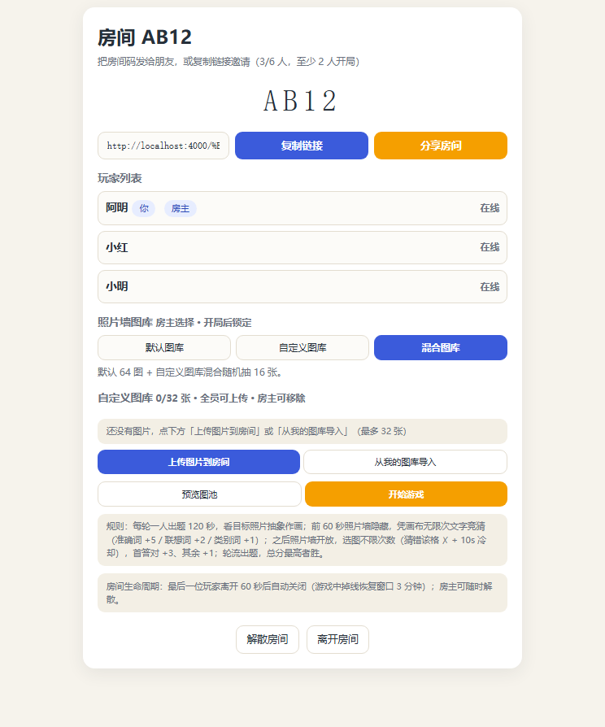
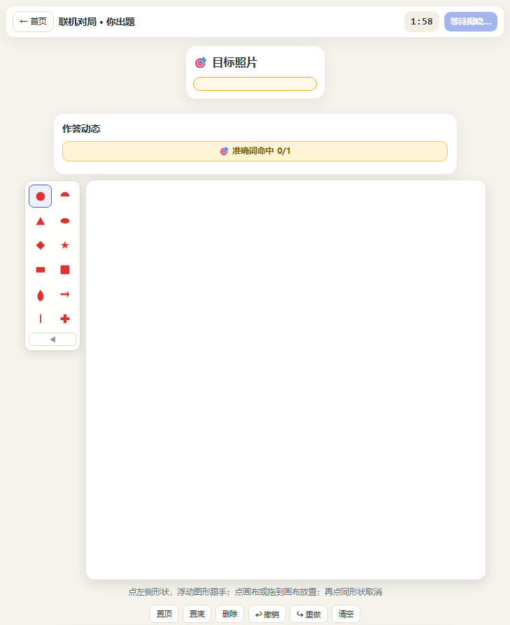
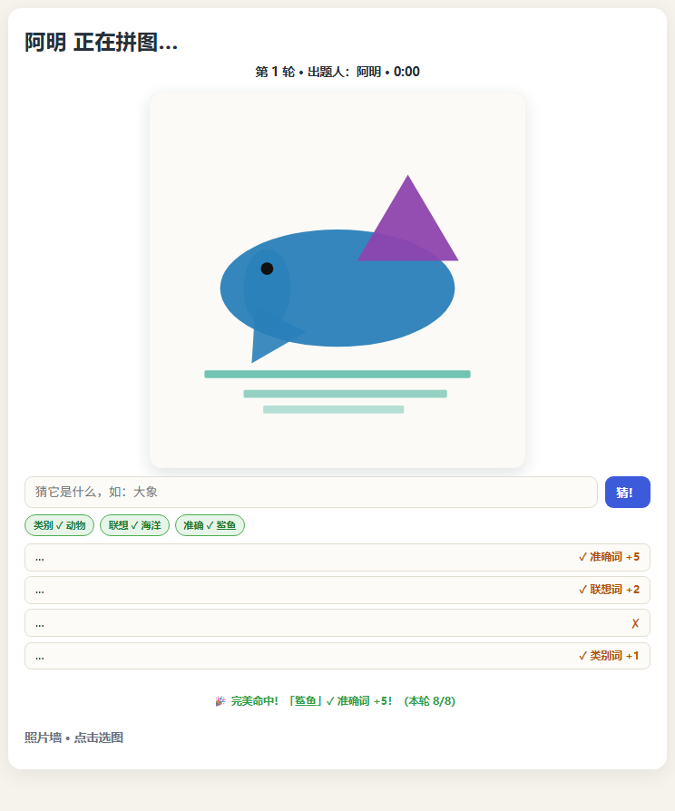
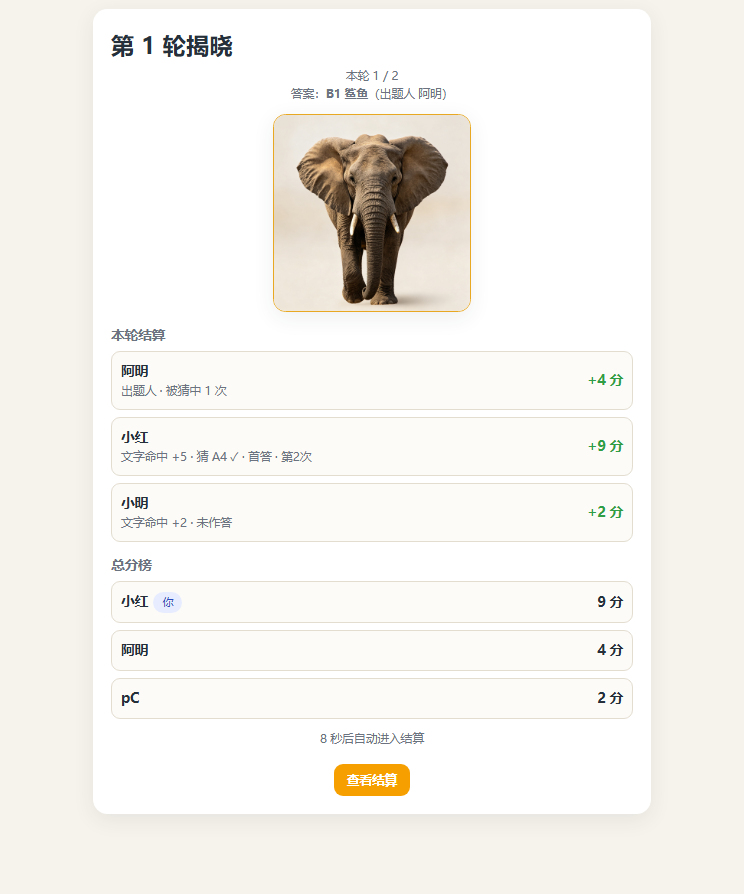

# 巧手猜图 · 网页版（pictures-web-game）

把《巧手猜图》桌游做成可直接在浏览器玩的网页游戏：看一张**写实照片**，用一套「不够像」的半透明形状把它**抽象地画出来**，让朋友实时竞猜。64 张 AI 生成写实照片图库 + Node WebSocket 实时联机对战 + 单人出题分享。

> 🕹️ 在线试玩：https://pictures-web-game.onrender.com/巧手猜图.html （Render 免费层，冷启动约 30–60 秒）

## 亮点

- **双模式**：联机对战（2–6 人实时房）· 单人出题（画完生成链接分享给朋友猜）
- **64 张写实照片图库**（8 类别 × 8 图），每轮随机抽 16 张；房主可选**默认图库 / 自定义图库 / 混合图库**
- **自定义图库**：全员可上传图片、裁剪取景、配三级词（类别/联想/准确），个人图库存本机 IndexedDB，玩过的图自动进「对局收藏」
- **画布工具**：12 种半透明形状（圆/三角/菱形/五角星/水滴/箭头/图标…）+ 细线画笔，置顶/置底/撤销/重做/清空/透明度
- **三级文字竞猜**：准确词 +5 / 联想词 +2 / 类别词 +1（同一词只命中一次），无限次文字竞猜
- **照片墙选图**：60 秒后开放 16 张照片，点大图即提交，猜错该格 ✗ + 10 秒冷却，首答 +3 / 后答 +1
- **出题人专属视角**：实时看到每个猜题人的猜词内容、命中层级、选图对错（猜题人之间仍匿名）
- 轮流出题，总分最高者胜；终局颁发 **MVP 徽章**（得分王 / 最快猜中 / 最佳出题）

## 截图

| 首页 | 房间大厅 |
|---|---|
|  |  |

| 出题人 · 看目标照片作画 | 猜题人 · 文字竞猜 + 照片墙 | 揭晓结算 |
|---|---|---|
|  |  |  |

## 玩法

- **联机对战**（2–6 人）：一人看**目标照片**抽象作画（120 秒，出题人只看到一张目标大图），其他人实时观看画布。
- **前 60 秒照片墙隐藏**，凭画布**无限次文字竞猜**：三级命中——准确词 +5 / 联想词 +2 / 类别词 +1（同一词只命中一次，可与选图分叠加）。猜测历史逐条显示 ✓/✗。
- **60 秒后照片墙开放**（出现在文字框下方），**选图不限次数**（猜错该格标 ✗ 不可再点 + 10 秒冷却；猜对即锁定）。首答选图对 +3、其余 +1。
- 出题人被猜中（文字 ∪ 选图按人去重）每人 +1；**出题人实时看到所有作答动态**：猜词内容（含未命中）、命中层级、选图对错——仅出题人可见，猜题人之间仍匿名（只广播命中层级，不含词/对错）。
- 轮流出题，总分最高者胜。目标索引在服务端保密，抓包拿不到。
- **在线房间列表**：联机入口加载即自动连接并 3 秒刷新「在线房间 · 点击加入」，只列等待中且未满的房间，点击直接加入（与房间码/分享链接互补）。

## 本地运行联机

```bash
npm install
node server.js        # 监听 4000 端口（或环境变量 PORT）
# 浏览器打开 http://localhost:4000/巧手猜图.html → 首页「联机对战」
```

`npm test` 运行后端测试（**46 项**：房间状态机、锁定窗口、三级文字竞猜、无限次选图 + 已试格 + 冷却、计分叠加、出题人作答动态 word_view/guess_view 保密边界、提前揭晓、轮换、目标保密、设备身份复用、房主选图库、自定义图库全员上传、房主离线自动让位、重连恢复、倒计时自动揭晓、房间列表、64 图词表完整性、进度+MVP 消息、图池预览/锁定，含真实 WebSocket 端到端）。
前端自检：联机 `#/onlinetest`（**121 项**，含出题人目标大图/作答动态、锁定期无照片墙、猜测记录、冷却流程、房主让位、游客连接、直接提交选图、对局自动收藏）、单人 `#/puzzletest`（**49 项**）。

## 部署到 Render（免费层，一键 Blueprint）

仓库已包含 [`render.yaml`](render.yaml)（Blueprint：node 20.18、`npm install` / `npm start`、健康检查 `/`、新加坡节点、free 实例）。

1. 打开 https://render.com 并用 GitHub 登录（首次会引导授权仓库）。
2. **New → Blueprint** → 选择仓库 `exceptionalpx/pictures-web-game` → Apply（render.yaml 自动生效）。
3. 等待首次构建（含 40MB 图片上传，约几分钟），完成后访问 `https://pictures-web-game.onrender.com`（实际子域名以控制台为准）。
4. 前端会自动使用同源 `wss://` 连接，手机/电脑直接玩。

免费层注意点：
- 无流量约 15 分钟实例休眠，首次访问冷启动 30–60 秒；建房时等它唤醒即可，之后 2–6 人对局体验正常。
- 前端内置 5 秒断线自动重连（保留身份与房间），休眠唤醒/网络波动后自动恢复。

## 技术结构

- `巧手猜图.html`：单文件正式版前端（首页 / 联机大厅 / 房间 / 出题编辑器 / 猜题 / 揭晓 / 终局 / `#/onlinetest`、`#/puzzletest` 内部 QA / `#/mylib` 个人图库）。
- `server.js`：Node + express + ws 单服务。64 图对象墙（`IMAGES`，开局随机抽 16 张）、三级命中判定（`matchLevel`）、房间状态机（Room/RoomManager）、WS 协议（`/ws`）、心跳与断线重连、目标保密分发、冷却与已试格权威判定、房主选图库（默认/自定义/混合）、房间自定义图库全员上传（上限 32）、房主离线自动让位（`hostPid`）、出题人专属 `word_view`/`guess_view`、提前命中直接放行、进度与 MVP 消息、图池预览/锁定。
- `image-pack-64.json`：64 图词表（v4，8 类别 × 8 图；每图 = 类别词 + 2 联想词 + 1 准确词）。
- `images/`：64 张写实照片（运行时图库）；`images-64-photo/` 为源资（含分类预览）。
- `test.js`：后端测试（`node --test --test-force-exit`，Windows 下 ws 残留句柄需 force-exit）。
- `render.yaml`：Render Blueprint 部署配置；`.github/workflows/test.yml`：push 自动跑 `npm test`。
- `tools/`：开发与图资生成脚本（`patch_*.py`、`make_preview*.py`、`dump_prompts.py` 等，留档）。
- `docs/`：设计方案、设计契约、GameFlow 与截图。

## 联机 WS 协议速览

- C→S：`create{nickname}` / `join{room_id,nickname}` / `rejoin{room_id,pid}` / `start{}` / `canvas{els}` / `guess{cell}` / `word{text}` / `list{}` / `next{}` / `ping{}`
- S→C：`created` / `joined` / `player_joined` / `round_start`（wall 16 张照片对象，`target` 仅出题人）/ `canvas` / `guess_ok{correct,first,done,tried}` / `error{err:"locked"|"tried"|"cooldown"|...,remain}` / `guess_status{answered,total}`（猜题人间匿名人数）/ `word_res{correct,repeat,level,pts,word}`（仅提交者）/ `word_hit{pid,nickname,level}`（猜题人广播，不含词）/ **`word_view{pid,nickname,word,correct,level,pts,repeat}`（仅出题人：每个猜词含未命中）** / **`guess_view{pid,nickname,cell,correct,first}`（仅出题人：选图对错）** / `list{rooms}` / `preview_pool` / `lock_pool` / `reveal{answer,answerLabel,answerImg,results,wordPts,maxRounds,isLast,mvp}` / `game_over{mvp}` / `pong`
- 文字命中：文本归一化后包含当前目标图词表任一答案词（exact > keyword > category 优先级，各层级分值 `wordScore:{category:1,keyword:2,exact:5}`）。
- 选图：服务端权威——正确即锁定（首答 +3 / 后答 +1）；错误记入 `tried` 不可再点并进入 10 秒冷却。

## License

[MIT](LICENSE)
